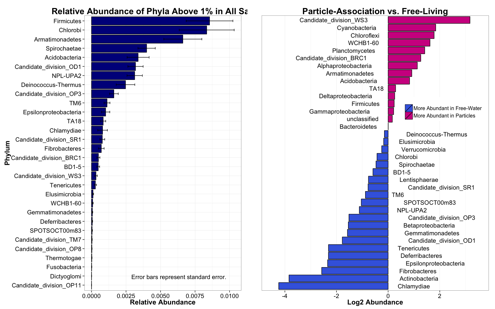

# The Saga of Marian's First Non-Parametric Statistical Tests
Marian L. Schmidt  
October 25th, 2014  

This is an R Markdown document. Markdown is a simple formatting syntax for authoring HTML, PDF, and MS Word documents. For more details on using R Markdown see <http://rmarkdown.rstudio.com>.

When you click the **Knit** button a document will be generated that includes both content as well as the output of any embedded R code chunks within the document. You can embed an R code chunk like this:

 

Phylum | P_Value | Bonferroni_P
--- | --- | ---
Alphaproteobacteria | 1.716e-03 | 4.638e-05
Betaproteobacteria | 1.233e-06 | 3.332e-08
Epsilonproteobacteria | 5.922e-03 | 1.600e-04
TA18 | 1.355e-03 | 3.663e-05
Acidobacteria | 1.864e-02 | 5.039e-04
Actinobacteria | 9.313e-10 | 2.517e-11
Armatimonadetes | 4.888e-04 | 1.321e-05
BD1-5 | 4.455e-02 | 1.204e-03
Candidate_division_BRC1 | 5.056e-03 | 1.366e-04
Candidate_division_OD1 | 7.848e-06 | 2.121e-07
Candidate_division_OP3 | 4.256e-05 | 1.150e-06
Candidate_division_WS3 | 5.857e-03 | 1.583e-04
Chlamydiae | 3.486e-03 | 9.422e-05
Chloroflexi | 1.431e-03 | 3.868e-05
Cyanobacteria | 9.313e-10 | 2.517e-11
Fibrobacteres | 5.889e-03 | 1.592e-04
Firmicutes | 1.432e-02 | 3.871e-04
Lentisphaerae | 3.627e-02 | 9.803e-04
NPL-UPA2 | 1.109e-05 | 2.997e-07
Planctomycetes | 1.276e-07 | 3.448e-09
Spirochaetae | 6.011e-03 | 1.625e-04
Tenericutes | 5.793e-03 | 1.566e-04
TM6 | 2.621e-02 | 7.083e-04

